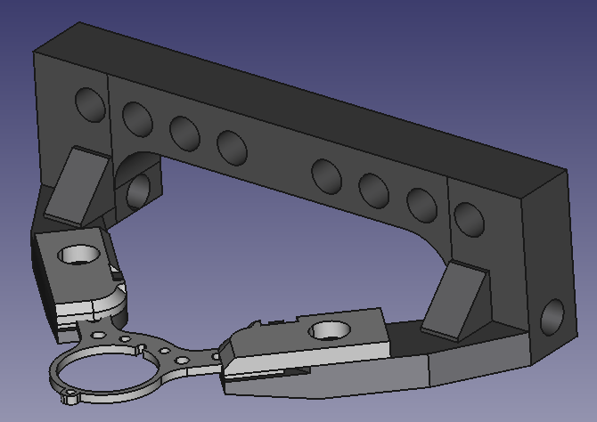
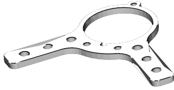

## hbar

This repository contains files for bars, holders and other 3d parts for imaging and electrophysiology.

The designs were created in FreeCAD - an open source design software.

These designs are currently being tested in the Churchland Lab by Joao Couto and Marsa Taheri.

### Holder for imaging and electrophysiology

This holder can be fabricated in stainless steel and is currently (September 2020) being tested for imaging.

The holes are designed to be treaded for 8-32 screws and 1mm tick post implants.

Model: [headbar_holder.FCStd](models/headbar_holder.FCStd)
3d:
 - [holder main](stl/headbar_holder_main.stl)
 - [left clamp](stl/headbar_holder_clamp_left.stl)
 - [right clamp](stl/headbar_holder_clamp_right.stl)

To manufacture use the [step](step/headbar_holder.step)

Files: 

### Post implant for imaging (11 mm)

The implant can be cut from a 1mm titanium sheet.

Model: [headbar.FCStd](models/headbar.FCStd)
3d: [imaging headbar](stl/headbar_imaging.stl)

To manufacture use the drawing in: [headbar.FCStd](models/headbar.FCStd)

#### Imaging ring

When implanting the post, we also center a ring on the window, this will interface with a light shielding sleeve that wraps around the objective.  

Model for the ring: [shield](imaging_shield.FCStd) - this file will also have the sleeve in the future.

To manufacture or visualize use the [stl file](stl/ring_imaging.stl). 

**Please drop me a line for feedback and let the world know if you use this.**

Joao Couto - jpcouto@gmail.com

Churchland lab - June 2020