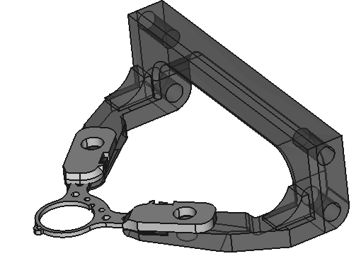

## hbar

This repository contains files for bars and holders.
The designs were created in  FreeCAD - an open source design software.

These designs were created and tested at the Churchland Lab at UCLA.

#### Holder for imaging and electrophysiology

**Please drop me a line for feedback and let the world know if you use this.**

Joao Couto - jpcouto@gmail.com

June 2020